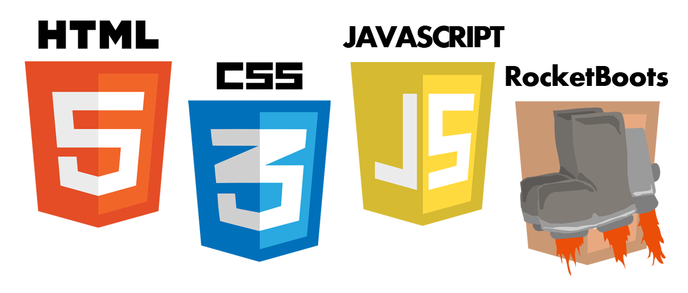

# RocketBoots Web Game Kit

RocketBoots is an open source kit to help create web games in JavaScript and HTML5. I wrote it to have a common foundation when making games for Ludum Dare and other game jams.

## How do I use this kit?

* Download the repo as a zip or clone it with GitHub, and add the scripts to your local game project.
* See the [components instructions](docs/components.md) and [list of components](docs/component-list.md) for the (sparse) documentation.
* Dig in: I recommend looking through [the RocketBoots code](https://github.com/rocket-boots/rocket-boots/tree/master/scripts/rocketboots) to see what each component offers. 
* Learn by examples: You might want to look through some of my games' code at https://github.com/deathraygames ... Most games in the last few years use RocketBoots in one way or another.

## What's included in this repo?

At the root you'll find:

* `scripts` directory
  * `libs` directory - contains various open source libraries that RocketBoots might use
    * jquery, lodash, etc.
  * `rocketboots` directory - contains the RocketBoots code
    * `core.js` - the core functionality that RocketBoots needs
    * [*various components*](docs/component-list.md) (`.js`) - these can be pulled in individually as needed
* `images` directory
* `docs` directory - contains documentation on how to use RocketBoots
* `README.md` (this file)
* `LICENSE` (MIT, which basically means it's free to use; does not necessarily apply to the scripts in `libs`)

You are free to structure your code however you'd like, but RocketBoots will try to use this directory structure for *scripts* by default.

## Contributing

If you have questions, ideas for new features, or found a bug -- please submit an issue on this project in GitHub. If you want to make some code changes, please feel free to fork and submit a pull request. 

